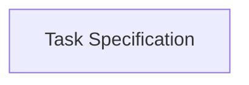

# Security Fix: Command Injection Vulnerability in GitHub Actions Workflows

## Summary
Fixed a critical command injection vulnerability in GitHub Actions workflows where PR/issue body content was being executed as shell commands.

## Vulnerability Details
- **Type**: Command Injection (CWE-77)
- **Severity**: Critical
- **Affected Files**: 
  - `.github/workflows/vsm-enhanced-ci-cd.yml`
  - `.github/workflows/vsm-unified-pipeline.yml`

## Root Cause
The workflows were directly interpolating user-controlled content from GitHub events into shell scripts:

```bash
# VULNERABLE CODE:
BODY="${{ github.event.issue.body }}"
```

When GitHub Actions evaluates expressions like `${{ github.event.issue.body }}`, it substitutes the content directly into the script. If a user creates an issue/PR with shell metacharacters or commands in the body, they would be executed.

## Attack Scenario
An attacker could create an issue with body content like:
```
`"; rm -rf /; echo "`
```

Or even just markdown content that contains shell-like syntax would cause errors:
```

```

## Fix Applied
Used heredoc syntax to safely capture the body content without shell interpretation:

```bash
# FIXED CODE:
BODY=$(cat << 'GITHUB_BODY_EOF'
${{ github.event.issue.body }}
GITHUB_BODY_EOF
)
```

This approach:
1. Uses a quoted heredoc delimiter (`'GITHUB_BODY_EOF'`) to prevent variable expansion
2. Captures the content as-is without shell interpretation
3. Safely assigns it to the BODY variable

## Verification
After the fix, the body content is treated as data, not code. Shell metacharacters, commands, and special syntax in PR/issue bodies will no longer be executed.

## Recommendations
1. Review all workflows for similar patterns where user input is interpolated into shell commands
2. Always use heredocs or proper escaping when handling user-controlled data in GitHub Actions
3. Consider using GitHub's built-in environment files for passing data between steps
4. Enable CodeQL or similar security scanning for GitHub Actions workflows

## References
- [GitHub Security Lab: Keeping your GitHub Actions and workflows secure](https://securitylab.github.com/research/github-actions-preventing-pwn-requests/)
- [OWASP: Command Injection](https://owasp.org/www-community/attacks/Command_Injection)