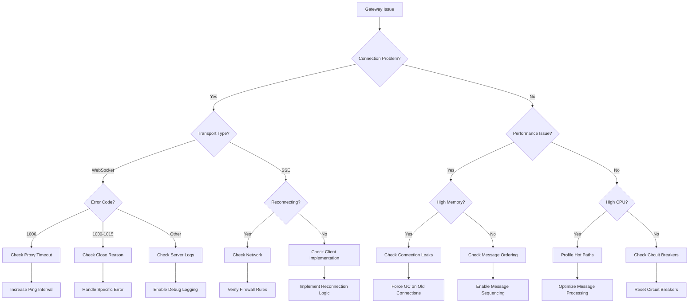

# MCP Gateway Troubleshooting Guide

This guide consolidates all debugging and troubleshooting information for the MCP Gateway. It's designed to help developers quickly diagnose and resolve common issues.

## Table of Contents

1. [Quick Diagnostics](#quick-diagnostics)
2. [Common Issues](#common-issues)
3. [Connection Problems](#connection-problems)
4. [Performance Issues](#performance-issues)
5. [Debugging Tools](#debugging-tools)
6. [Error Reference](#error-reference)
7. [Recovery Procedures](#recovery-procedures)
8. [Monitoring and Alerts](#monitoring-and-alerts)

## Quick Diagnostics

### Health Check Commands

```bash
# Quick gateway health check
curl http://localhost:4000/health/gateway

# Check specific client connection
curl http://localhost:4000/mcp/health/client/user123

# Get transport statistics
curl http://localhost:4000/mcp/stats

# Force connection cleanup (admin only)
curl -X POST http://localhost:4000/mcp/admin/cleanup \
  -H "Authorization: Bearer admin-token"
```

### IEx Quick Commands

```elixir
# Gateway status overview
Gateway.status()

# Connection statistics
Gateway.get_connection_stats()

# Check specific client
Gateway.get_client_info("user123")

# Circuit breaker states
CircuitBreaker.get_states(:mcp_gateway)
```

## Common Issues

### 1. Connection Pool Exhaustion

**Symptoms:**
- `{:error, :pool_timeout}` errors
- Slow response times
- Connection rejections

**Quick Fix:**
```elixir
# Check pool status
ConnectionPool.health_check()

# Increase pool size temporarily
Application.put_env(:autonomous_opponent_core, :mcp_gateway,
  put_in(Application.get_env(:autonomous_opponent_core, :mcp_gateway)[:pool][:size], 200)
)

# Force cleanup of idle connections
Gateway.cleanup_idle_connections(max_idle_seconds: 60)
```

**Permanent Solution:**
Update configuration in `config/prod.exs`:
```elixir
config :autonomous_opponent_core, :mcp_gateway,
  pool: [
    size: 200,          # Increase from 100
    overflow: 100,      # Increase from 50
    idle_timeout: 60_000 # Reduce from 300_000
  ]
```

### 2. Transport Failover Loop

**Symptoms:**
- Repeated failover events in logs
- Client constantly switching transports
- High CPU usage

**Quick Fix:**
```elixir
# Check transport health
Gateway.HealthCheck.check_transport_health(:websocket)
Gateway.HealthCheck.check_transport_health(:http_sse)

# Increase failover threshold
Application.put_env(:autonomous_opponent_core, :mcp_gateway,
  put_in(Application.get_env(:autonomous_opponent_core, :mcp_gateway)[:routing][:failover_threshold], 10)
)
```

**Root Cause Analysis:**
```elixir
# Check S2 coordination for oscillation
EventBus.call(:s2_coordination, %{
  request: :check_oscillation,
  client: "affected_client_id"
})
```

### 3. High Memory Usage

**Symptoms:**
- Growing memory consumption
- OOM killer activating
- Slow garbage collection

**Diagnostics:**
```elixir
# Memory breakdown
:recon_alloc.memory(:allocated)

# Find memory hogs
:recon.proc_count(:memory, 10)

# Check for binary leaks
:recon.bin_leak(5)

# Connection age analysis
Gateway.analyze_connections()
```

**Solutions:**
```elixir
# Force garbage collection on old connections
Gateway.gc_old_connections(hours: 24)

# Reduce connection lifetime
Application.put_env(:autonomous_opponent_core, :mcp_gateway,
  put_in(Application.get_env(:autonomous_opponent_core, :mcp_gateway)[:pool][:idle_timeout], 30_000)
)
```

### 4. Rate Limiting Issues

**Symptoms:**
- `rate_limit_exceeded` errors
- Legitimate traffic being blocked
- Uneven rate limiting

**Diagnostics:**
```elixir
# Check rate limiter status for client
RateLimiter.check_rate("user:user123", 100, 60_000)

# View rate limit metrics
Gateway.get_rate_limit_stats()
```

**Adjustments:**
```elixir
# Temporarily increase limits
defmodule Gateway.RateLimitOverride do
  def set_limit(client_id, new_limit) do
    key = "user:#{client_id}"
    RateLimiter.set_limit(key, new_limit, 60_000)
  end
end
```

## Connection Problems

### WebSocket Connection Drops (Code 1006)

**Problem:** Client receives CloseEvent with code 1006, indicating abnormal closure.

**Common Causes:**
1. Proxy/firewall timeout
2. Network interruption
3. Server-side idle timeout
4. Load balancer configuration

**Diagnostic Steps:**

```elixir
# 1. Check client connection history
iex> Gateway.get_client_errors("user123", :websocket)

# 2. Verify timeout settings
iex> Application.get_env(:autonomous_opponent_core, :mcp_gateway)[:websocket]

# 3. Check for patterns
iex> Gateway.analyze_1006_errors(last_hours: 24)
```

**Solutions:**

1. **Client-side heartbeat:**
```javascript
const socket = new Socket("/mcp/ws", {
  heartbeatIntervalMs: 25000,  // More frequent than server timeout
  params: {client_id: clientId}
})

// Application-level keepalive
setInterval(() => {
  if (channel.state === "joined") {
    channel.push("ping", {})
  }
}, 20000)
```

2. **Server-side configuration:**
```elixir
config :autonomous_opponent_core, :mcp_gateway,
  websocket: [
    idle_timeout: 60_000,      # Increase from 30s
    ping_interval: 25_000,     # More frequent pings
    pong_timeout: 15_000       # Allow more time for pong
  ]
```

3. **Infrastructure adjustments:**
```nginx
# NGINX configuration
location /mcp/ws {
    proxy_read_timeout 3600s;
    proxy_send_timeout 3600s;
    proxy_connect_timeout 75s;
    
    # WebSocket headers
    proxy_http_version 1.1;
    proxy_set_header Upgrade $http_upgrade;
    proxy_set_header Connection "upgrade";
}
```

### SSE Reconnection Issues

**Problem:** EventSource doesn't automatically reconnect after network interruption.

**Robust SSE Client Implementation:**

```javascript
class RobustEventSource {
  constructor(url, options = {}) {
    this.url = url
    this.options = options
    this.reconnectDelay = 1000
    this.maxReconnectDelay = 30000
    this.reconnectDecay = 1.5
    this.reconnectAttempts = 0
    this.shouldReconnect = true
    
    this.connect()
  }
  
  connect() {
    this.eventSource = new EventSource(this.url)
    
    this.eventSource.onopen = () => {
      console.log('SSE connected')
      this.reconnectDelay = 1000
      this.reconnectAttempts = 0
      this.options.onOpen?.()
    }
    
    this.eventSource.onerror = (error) => {
      console.error('SSE error:', error)
      this.eventSource.close()
      
      if (this.shouldReconnect) {
        const delay = Math.min(
          this.reconnectDelay * Math.pow(this.reconnectDecay, this.reconnectAttempts),
          this.maxReconnectDelay
        )
        
        console.log(`Reconnecting in ${delay}ms...`)
        setTimeout(() => this.connect(), delay)
        this.reconnectAttempts++
      }
      
      this.options.onError?.(error)
    }
    
    // Re-attach all event listeners
    Object.entries(this.options.events || {}).forEach(([event, handler]) => {
      this.eventSource.addEventListener(event, handler)
    })
  }
  
  close() {
    this.shouldReconnect = false
    this.eventSource?.close()
  }
}
```

### Authentication Failures

**Error Pattern:**
```json
{
  "error": "authentication_failed",
  "reason": "invalid_token",
  "retry_after": null
}
```

**Handling Strategy:**
```javascript
channel.join()
  .receive("error", ({error, reason}) => {
    if (error === "authentication_failed") {
      if (reason === "token_expired") {
        // Refresh token and retry
        refreshToken().then(newToken => {
          socket.params.token = newToken
          socket.disconnect(() => socket.connect())
        })
      } else {
        // Redirect to login
        window.location.href = "/login"
      }
    }
  })
```

## Performance Issues

### Message Ordering Problems

**Problem:** Messages arrive out of order during transport switches.

**Server-side Solution:**
```elixir
defmodule Gateway.MessageSequencer do
  def sequence_message(client_id, message) do
    sequence_number = get_next_sequence(client_id)
    
    %{
      sequence: sequence_number,
      timestamp: System.monotonic_time(:microsecond),
      payload: message
    }
  end
  
  def buffer_out_of_order(client_id, message) do
    buffer = get_buffer(client_id)
    expected = get_expected_sequence(client_id)
    
    if message.sequence == expected do
      # Process this message and any buffered ones
      process_sequential_messages(client_id, [message | buffer])
    else
      # Buffer for later
      add_to_buffer(client_id, message)
      {:buffered, message.sequence}
    end
  end
end
```

**Client-side Handler:**
```javascript
class MessageSequencer {
  constructor() {
    this.expected = 0
    this.buffer = new Map()
    this.maxBufferSize = 100
  }
  
  handleMessage(message) {
    if (message.sequence === this.expected) {
      this.processMessage(message)
      this.expected++
      
      // Process any buffered messages
      while (this.buffer.has(this.expected)) {
        const buffered = this.buffer.get(this.expected)
        this.buffer.delete(this.expected)
        this.processMessage(buffered)
        this.expected++
      }
    } else if (message.sequence > this.expected) {
      // Buffer out-of-order message
      if (this.buffer.size < this.maxBufferSize) {
        this.buffer.set(message.sequence, message)
      } else {
        console.error('Message buffer full, dropping:', message)
      }
    }
  }
}
```

### Backpressure Management

**Problem:** Client overwhelmed by message volume.

**Server-side Adaptive Backpressure:**
```elixir
defmodule Gateway.BackpressureManager do
  def should_throttle?(client_id) do
    stats = get_client_stats(client_id)
    
    cond do
      stats.pending_acks > 100 -> {:throttle, :high}
      stats.pending_acks > 50 -> {:throttle, :medium}
      stats.message_lag > 5000 -> {:throttle, :lagging}
      true -> :ok
    end
  end
  
  def apply_backpressure(client_id, level) do
    case level do
      :high ->
        # Drop non-critical messages
        filter_critical_only(client_id)
        
      :medium ->
        # Slow down message rate
        reduce_rate(client_id, 0.5)
        
      :lagging ->
        # Bundle messages
        enable_bundling(client_id, interval: 1000)
    end
  end
end
```

**Client-side Flow Control:**
```javascript
class FlowControlledClient {
  constructor(channel) {
    this.channel = channel
    this.pendingAcks = 0
    this.maxPending = 50
    
    this.channel.on("message", (msg) => {
      if (this.pendingAcks < this.maxPending) {
        this.handleMessage(msg)
        this.pendingAcks++
      } else {
        console.warn("Dropping message due to backpressure")
      }
    })
  }
  
  handleMessage(msg) {
    processAsync(msg).then(() => {
      this.pendingAcks--
      this.channel.push("ack", {msg_id: msg.id})
    })
  }
}
```

## Debugging Tools

### Enable Debug Logging

```elixir
# config/dev.exs
config :logger, level: :debug
config :autonomous_opponent_core, :mcp_gateway,
  debug: true,
  log_connections: true,
  log_messages: true,
  trace_routing: true
```

### IEx Debugging Commands

```elixir
# Get connection statistics
iex> Gateway.get_connection_stats()
%{
  total: 1523,
  by_transport: %{websocket: 1200, http_sse: 323},
  pool_available: 45,
  pool_overflow: 12,
  avg_connection_age: 3600,
  error_rate: 0.02
}

# Trace specific client
iex> Gateway.trace_client("user123")
[
  %{timestamp: ~U[2024-01-15 10:23:45Z], event: :connected, transport: :websocket},
  %{timestamp: ~U[2024-01-15 10:23:46Z], event: :message_sent, size: 1024},
  %{timestamp: ~U[2024-01-15 10:24:12Z], event: :transport_switch, from: :websocket, to: :http_sse}
]

# Check connection pool health
iex> ConnectionPool.health_check()

# View consistent hash distribution
iex> ConsistentHash.get_distribution()

# Force garbage collection on connections
iex> Gateway.cleanup_idle_connections(max_idle_seconds: 300)

# Check circuit breaker states
iex> CircuitBreaker.get_states(:mcp_gateway)
```

### Live Monitoring with Observer

```elixir
# Start Observer for visual debugging
iex> :observer.start()

# Navigate to:
# Applications -> autonomous_opponent_core
# Look for MCP.Gateway supervision tree
```

### Client-side Debugging

**WebSocket Debugging:**
```javascript
const socket = new Socket("/mcp/ws", {
  params: {client_id: "debug_user"},
  logger: (kind, msg, data) => {
    console.log(`${kind}: ${msg}`, data);
  }
});

socket.onError((error) => console.error("Socket error:", error));
socket.onClose(() => console.log("Socket closed"));

// Enable verbose Phoenix.js logging
window.Phoenix = {debug: true};
```

**SSE Debugging:**
```javascript
const eventSource = new EventSource('/mcp/sse?client_id=debug_user&debug=true');

eventSource.addEventListener('debug', (event) => {
  console.log('Debug info:', JSON.parse(event.data));
});

// Monitor all events
['open', 'message', 'error', 'connected', 'heartbeat'].forEach(eventType => {
  eventSource.addEventListener(eventType, (event) => {
    console.log(`SSE ${eventType}:`, event);
  });
});
```

### Performance Profiling

```elixir
# Profile specific function
iex> ExProf.start()
iex> ExProf.trace(:calls, Gateway, :route_message, 3)
iex> # Generate some traffic
iex> ExProf.analyze()

# Profile memory usage
iex> :recon.proc_count(:memory, 10)

# Check message queue lengths
iex> :recon.proc_count(:message_queue_len, 10)

# Memory breakdown
iex> :recon_alloc.memory(:allocated)

# Find memory fragmentation
iex> :recon_alloc.fragmentation(:current)
```

### Connection Leak Detection

```elixir
# Find long-lived connections
iex> Gateway.find_old_connections(hours: 24)

# Analyze connection patterns
iex> Gateway.analyze_connections()
%{
  connection_distribution: %{
    "0-1h": 892,
    "1-6h": 421,
    "6-24h": 187,
    "24h+": 23
  },
  suspicious_patterns: [
    %{pattern: :rapid_reconnect, client_ids: ["bot123", "bot456"]},
    %{pattern: :connection_hoarding, client_ids: ["user789"]}
  ]
}
```

### Log Analysis

```bash
# Find errors in gateway logs
grep "MCP.Gateway" logs/error.log | grep -E "(error|failed|timeout)"

# Analyze connection patterns
awk '/connected/ {print $1}' logs/gateway.log | sort | uniq -c | sort -nr

# Track specific client
grep "client_id=user123" logs/gateway.log | tail -f

# Monitor error rates
tail -f logs/error.log | grep -E "MCP\.(Gateway|Transport)" | \
  awk '{print strftime("%Y-%m-%d %H:%M:%S"), $0}'
```

## Error Reference

### Transport Errors

| Error Code | Description | Common Cause | Solution |
|------------|-------------|--------------|----------|
| 1000 | Normal closure | Client disconnect | Normal behavior |
| 1001 | Going away | Server shutdown | Implement reconnection |
| 1006 | Abnormal closure | Network/proxy timeout | Increase timeouts |
| 1008 | Policy violation | Message too large | Reduce message size |
| 1011 | Server error | Internal error | Check server logs |

### Gateway-specific Errors

| Error | Description | Solution |
|-------|-------------|----------|
| pool_timeout | Connection pool exhausted | Increase pool size |
| rate_limit_exceeded | Too many requests | Implement client throttling |
| circuit_open | Circuit breaker triggered | Check transport health |
| transport_unavailable | No healthy transports | Check all transport configs |
| authentication_failed | Invalid credentials | Refresh authentication |

## Recovery Procedures

### Automatic Recovery Implementation

```javascript
class RecoveryManager {
  constructor(gateway) {
    this.gateway = gateway
    this.baseDelay = 1000
    this.maxDelay = 60000
    this.attempts = 0
  }
  
  async attemptRecovery(error) {
    const delay = Math.min(
      this.baseDelay * Math.pow(2, this.attempts),
      this.maxDelay
    )
    
    console.log(`Recovery attempt ${this.attempts + 1} in ${delay}ms`)
    
    await this.sleep(delay)
    
    try {
      await this.gateway.reconnect()
      this.attempts = 0  // Reset on success
      return true
    } catch (e) {
      this.attempts++
      if (this.attempts < 10) {
        return this.attemptRecovery(e)
      } else {
        throw new Error('Max recovery attempts exceeded')
      }
    }
  }
  
  sleep(ms) {
    return new Promise(resolve => setTimeout(resolve, ms))
  }
}
```

### Manual Recovery Steps

1. **Check System Health:**
   ```bash
   curl http://localhost:4000/health
   ```

2. **Reset Circuit Breakers:**
   ```elixir
   CircuitBreaker.reset(:mcp_gateway, :websocket)
   CircuitBreaker.reset(:mcp_gateway, :http_sse)
   ```

3. **Clear Connection Pool:**
   ```elixir
   ConnectionPool.clear_all()
   Gateway.restart_pool()
   ```

4. **Force Transport Restart:**
   ```elixir
   Supervisor.restart_child(Gateway, Transport.WebSocket)
   Supervisor.restart_child(Gateway, Transport.HTTPSSE)
   ```

## Monitoring and Alerts

### Key Metrics to Monitor

```elixir
defmodule Gateway.Monitoring do
  def critical_metrics do
    %{
      pool_exhaustion: ConnectionPool.exhaustion_rate(),
      error_rate: Gateway.error_rate(last_minutes: 5),
      connection_age: Gateway.avg_connection_age(),
      circuit_breaker_status: CircuitBreaker.all_states(),
      message_lag: Gateway.avg_message_lag()
    }
  end
  
  def alert_thresholds do
    %{
      pool_exhaustion: 0.9,     # 90% pool usage
      error_rate: 0.05,         # 5% errors
      connection_age: 86400,    # 24 hours
      message_lag: 5000         # 5 seconds
    }
  end
end
```

### Prometheus Metrics

```elixir
# Key metrics exposed at /metrics
gateway_connections_total{transport="websocket"}
gateway_connections_total{transport="http_sse"}
gateway_messages_total{direction="inbound"}
gateway_messages_total{direction="outbound"}
gateway_errors_total{type="connection"}
gateway_pool_usage_ratio
gateway_circuit_breaker_state{transport="websocket"}
```

### Alert Rules

```yaml
# prometheus/alerts.yml
groups:
  - name: mcp_gateway
    rules:
      - alert: GatewayPoolExhaustion
        expr: gateway_pool_usage_ratio > 0.9
        for: 5m
        annotations:
          summary: "Gateway connection pool near exhaustion"
          
      - alert: GatewayHighErrorRate
        expr: rate(gateway_errors_total[5m]) > 0.05
        for: 5m
        annotations:
          summary: "Gateway error rate exceeds 5%"
          
      - alert: GatewayCircuitOpen
        expr: gateway_circuit_breaker_state == 0
        for: 1m
        annotations:
          summary: "Gateway circuit breaker is open"
```

## Troubleshooting Decision Tree



## Quick Reference Card

### Emergency Commands

```bash
# Restart gateway
systemctl restart autonomous-opponent

# Check logs
journalctl -u autonomous-opponent -f

# Clear all connections
curl -X POST http://localhost:4000/mcp/admin/reset \
  -H "Authorization: Bearer admin-token"
```

### Common Fixes

| Problem | Quick Fix |
|---------|-----------|
| Pool timeout | `Application.put_env(:autonomous_opponent_core, :mcp_gateway, pool: [size: 200])` |
| Circuit open | `CircuitBreaker.reset(:mcp_gateway, :all)` |
| Memory leak | `Gateway.gc_old_connections(hours: 1)` |
| Rate limit | `RateLimiter.reset("user:affected_user")` |

### Support Contacts

- Gateway Team: gateway@example.com
- On-call: +1-555-GATEWAY
- Slack: #mcp-gateway-support

---

Remember: When in doubt, check the logs first! Most issues leave clear traces in the application logs.