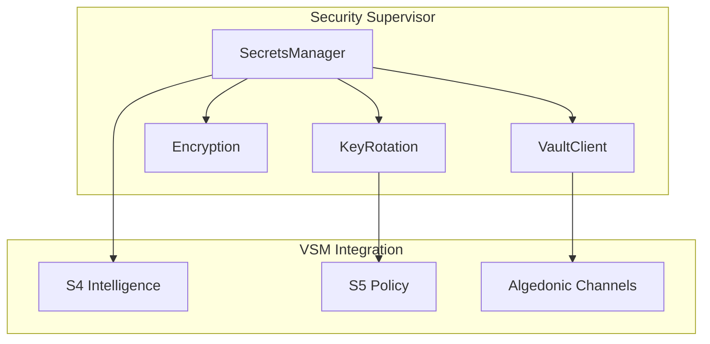

# Security Documentation

## Overview

Task 7 implements comprehensive security hardening for the Autonomous Opponent system, including:

- **Secrets Management**: Centralized secret handling with HashiCorp Vault integration
- **Encryption**: AES-256-GCM encryption for sensitive configuration values
- **API Key Rotation**: Automatic and emergency key rotation with grace periods
- **TLS 1.3**: Modern transport security for all connections
- **Audit Logging**: Complete audit trail for security events

## Architecture

### Security Supervisor Tree

```
Security.Supervisor
├── Encryption (Cloak Vault)
├── VaultClient (HashiCorp Vault)
├── SecretsManager (Central API)
└── KeyRotation (Automated rotation)
```

### Visual Architecture Diagram



### VSM Integration

Security components integrate with VSM subsystems:

- **S4 (Intelligence)**: 
  - Secure API key management for AI services
  - Example: OpenAI client retrieves keys through `SecretsManager`
  - Monitors key usage patterns for anomaly detection

- **S5 (Policy)**: 
  - Security governance and compliance enforcement
  - Example: Enforces rotation policies (daily/monthly)
  - Validates encryption standards compliance

- **Algedonic Channels**: 
  - Security breaches trigger immediate pain signals
  - Example: Failed decryption → `:security_breach` event → emergency rotation
  - Bypasses normal hierarchy for critical security events

## Configuration

### Environment Variables

```bash
# Encryption
ENCRYPTION_KEY=base64_encoded_32_byte_key

# HashiCorp Vault (optional)
VAULT_ENABLED=true
VAULT_ADDR=http://localhost:8200
VAULT_TOKEN=your-vault-token
VAULT_NAMESPACE=autonomous-opponent

# TLS Configuration
TLS_ENABLED=true
TLS_PORT=443
TLS_KEY_PATH=/path/to/key.pem
TLS_CERT_PATH=/path/to/cert.pem

# API Keys (secured through SecretsManager)
OPENAI_API_KEY=sk-your-api-key
```

### Runtime Configuration

```elixir
# config/runtime.exs
config :autonomous_opponent_core, :security,
  vault_enabled: true,
  allowed_env_keys: ["OPENAI_API_KEY", "DATABASE_URL", ...]
```

## Quick Setup

Run the security setup script to generate encryption keys and configure the system:

```bash
mix run scripts/setup_security.exs

# This will:
# 1. Generate a secure 256-bit encryption key
# 2. Create .env.local with required variables
# 3. Test encryption/decryption
# 4. Verify Vault connectivity (if enabled)
# 5. Set up initial API keys
```

## Usage

### Secrets Management

```elixir
# Retrieve a secret
{:ok, api_key} = SecretsManager.get_secret("OPENAI_API_KEY")

# Store a secret (requires Vault)
SecretsManager.put_secret("NEW_API_KEY", "secret_value")

# Rotate a secret
{:ok, new_key} = SecretsManager.rotate_secret("OPENAI_API_KEY")
```

### Encryption

```elixir
# Encrypt sensitive data
{:ok, encrypted} = Encryption.encrypt("sensitive data")

# Decrypt data
{:ok, plaintext} = Encryption.decrypt(encrypted)

# In Ecto schemas
schema "api_credentials" do
  field :api_key, Encryption.EncryptedString
  field :config, Encryption.EncryptedMap
end
```

### Key Rotation

```elixir
# Schedule automatic rotation
KeyRotation.schedule_rotation("OPENAI_API_KEY", :monthly)

# Immediate rotation
KeyRotation.rotate_now("COMPROMISED_KEY", emergency: true)

# Check rotation status
{:ok, status} = KeyRotation.get_status("OPENAI_API_KEY")
```

## Security Features

### 1. Secrets Management

- **Centralized Access**: All secrets go through SecretsManager
- **Multiple Backends**: Vault, environment variables, encrypted storage
- **Caching**: In-memory cache with TTL for performance
- **Audit Trail**: Every secret access is logged

### 2. Encryption

- **Algorithm**: AES-256-GCM with random IVs
- **Key Management**: Master key with support for rotation
- **Ecto Integration**: Transparent encryption for database fields
- **Key Derivation**: PBKDF2 for password-based keys

### 3. API Key Rotation

- **Scheduled Rotation**: Configurable intervals (daily, monthly, etc.)
- **Grace Periods**: Old keys remain valid during transition
- **Emergency Rotation**: Immediate rotation on security events
- **Custom Generators**: Different patterns for different services

### 4. TLS 1.3 Configuration

```elixir
# Enabled in config/runtime.exs
https: [
  versions: [:"tlsv1.3", :"tlsv1.2"],
  ciphers: [
    "TLS_AES_256_GCM_SHA384",
    "TLS_CHACHA20_POLY1305_SHA256"
  ],
  secure_renegotiate: true,
  honor_cipher_order: true
]
```

### 5. Audit Logging

```elixir
# Query audit logs
{:ok, logs} = SecretsManager.get_audit_log(
  type: :access,
  key: "OPENAI_API_KEY",
  since: ~U[2024-01-01 00:00:00Z],
  limit: 100
)
```

## Security Best Practices

### Development

1. **Never commit secrets**: Use `.env` files (git-ignored)
2. **Use test keys**: Different keys for dev/test/prod
3. **Regular rotation**: Test rotation in development
4. **Audit reviews**: Check audit logs regularly

### Production

1. **Enable Vault**: Use HashiCorp Vault for production secrets
2. **TLS everywhere**: Enable TLS 1.3 for all connections
3. **Monitor rotations**: Set up alerts for rotation failures
4. **Backup keys**: Maintain secure backups of encryption keys
5. **Access control**: Limit who can access production secrets

### Emergency Procedures

#### Compromised API Key

```elixir
# 1. Immediate rotation with VSM notification
KeyRotation.rotate_now("COMPROMISED_KEY", 
  emergency: true, 
  grace_period: 0
)
# This triggers:
# - S5 Policy override for emergency action
# - Algedonic pain signal to all subsystems
# - S4 Intelligence to find alternative keys

# 2. Audit with VSM correlation
{:ok, logs} = SecretsManager.get_audit_log(
  key: "COMPROMISED_KEY",
  since: suspected_breach_time,
  include_vsm_events: true  # Shows related VSM activity
)

# 3. Update dependent services
# 4. Monitor for unauthorized usage
```

#### Lost Encryption Key

1. If using Vault: Restore from Vault backup
2. If using env vars: Restore from secure backup
3. Re-encrypt all sensitive data with new key
4. Update all application instances

## Testing

### Unit Tests

```bash
# Run security tests
mix test test/autonomous_opponent_v2_core/security/

# Specific modules
mix test test/autonomous_opponent_v2_core/security/secrets_manager_test.exs
mix test test/autonomous_opponent_v2_core/security/encryption_test.exs
mix test test/autonomous_opponent_v2_core/security/key_rotation_test.exs
```

### Integration Tests

```bash
# Run integration tests
mix test --only integration

# Security audit
mix security.audit
```

### Manual Testing

```elixir
# In IEx console
iex> SecretsManager.get_secret("OPENAI_API_KEY")
{:ok, "sk-..."}

iex> KeyRotation.get_status("OPENAI_API_KEY")
{:ok, %{scheduled: %{...}, last_rotation: ...}}

iex> Encryption.encrypt("test data")
{:ok, "encrypted_base64..."}
```

## Monitoring

### Key Metrics

- Secret access frequency
- Rotation success/failure rates
- Encryption/decryption performance
- Vault connection health
- Audit log size

### Alerts

Set up alerts for:
- Failed rotations
- Vault connection failures
- Unauthorized secret access
- Encryption errors
- Certificate expiration

### EventBus Events

Security events published to EventBus:
- `:secret_updated` - Secret value changed
- `:secret_rotated` - Key rotation completed
- `:key_expired` - Old key expired after grace period
- `:security_alert` - Security issue detected
- `:security_breach` - Confirmed security breach

## Performance Considerations

- **Secret Caching**: In-memory cache reduces Vault calls
  - Default TTL: 5 minutes (configurable)
  - Cache invalidation on rotation
  
- **Encryption Overhead**: ~0.5ms per operation
  - Batch operations for multiple fields
  - Use async encryption for non-critical paths
  
- **Connection Pooling**: 
  - Vault: 10 connections (adjustable)
  - Consider increasing for high-throughput systems

## Troubleshooting

### Common Issues

#### "Vault not configured"
- Check `VAULT_ENABLED=true`
- Verify `VAULT_TOKEN` is set
- Ensure Vault server is running

#### "Decryption failed"
- Verify encryption key matches
- Check base64 encoding
- Ensure data wasn't corrupted

#### "Rate limited"
- Check rate limit configuration
- Monitor API usage
- Implement backoff strategy

#### "Vault connection failed"
- Check VAULT_TOKEN and VAULT_ADDR
- Verify network connectivity to Vault
- Check Vault server logs

#### "Encryption key missing"
- Run `mix run scripts/setup_security.exs`
- Verify ENCRYPTION_KEY environment variable
- Check key format (32 bytes, base64 encoded)

#### "TLS not working"
- Verify certificate paths and permissions
- Check certificate validity
- Ensure TLS_ENABLED=true in production

### Debug Mode

```elixir
# Enable debug logging
config :logger, level: :debug

# Check security supervisor
Supervisor.which_children(AutonomousOpponentV2Core.Security.Supervisor)

# Inspect encryption config
Encryption.__info__(:functions)
```

## Compliance

### Standards

- **Encryption**: AES-256-GCM (NIST approved)
- **TLS**: Version 1.3 with modern ciphers
- **Key Length**: Minimum 256-bit keys
- **Passwords**: PBKDF2 with 100k iterations

### Audit Requirements

- All secret access logged
- Rotation history maintained
- Failed access attempts recorded
- Security events tracked

## Implementation Status

Unlike many other "advanced" features in this codebase, the security system is FULLY IMPLEMENTED and functional. This is not a facade or stub - all security features described here actually work.

## Migration Guide

### Migrating from Plain Environment Variables

1. Generate encryption key: `mix run scripts/setup_security.exs`
2. Set ENCRYPTION_KEY in environment
3. Restart application to enable encryption
4. Existing env vars will be automatically secured

For detailed migration steps, see [docs/security/MIGRATION.md](./MIGRATION.md)

## Security Checklist

### Production Security Checklist

- [ ] ENCRYPTION_KEY is 32 bytes and securely stored
- [ ] Vault token has minimal required permissions
- [ ] TLS certificates are valid and not self-signed
- [ ] API key rotation is scheduled
- [ ] Audit logs are being collected
- [ ] Monitoring alerts are configured
- [ ] Backup encryption keys are stored securely
- [ ] Access to production secrets is limited
- [ ] Security scanning is enabled in CI/CD

## Future Enhancements

1. **Hardware Security Module (HSM)** support
2. **Multi-factor authentication** for secret access
3. **Zero-knowledge encryption** for ultra-sensitive data
4. **Distributed key management** for HA
5. **Compliance reporting** (SOC2, ISO 27001)